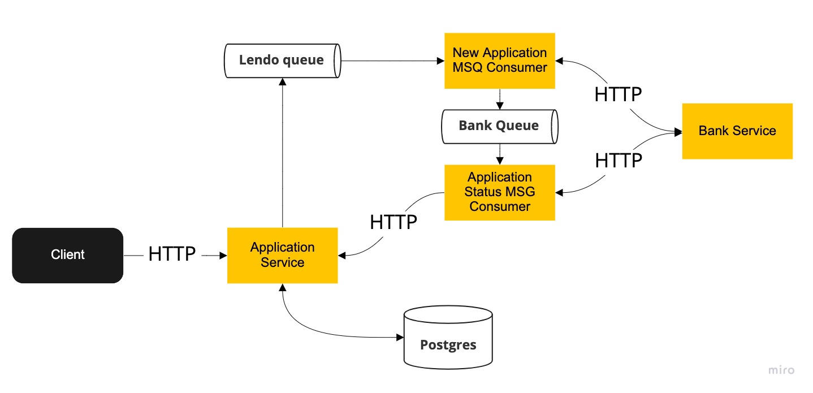

# lendo-interview

## Service Flow Chart


### To start the service
```bash
docker-compose up --build
```

Then go to http://localhost:8000/docs to see the documentation of endpoints.

### service-application has 4 endpoints
1. Post an application
2. Get an application by id
3. Get applications by status
4. Update an application's status


### service-job has 2 consumers
1. Message pushed by service-application for new application
2. Message pushed by the first consumer after bank_partner_api returned "pending" status, the 2nd consumer will call bank_partner_api every 5s to get the latest status and then "PUT" to service-application
